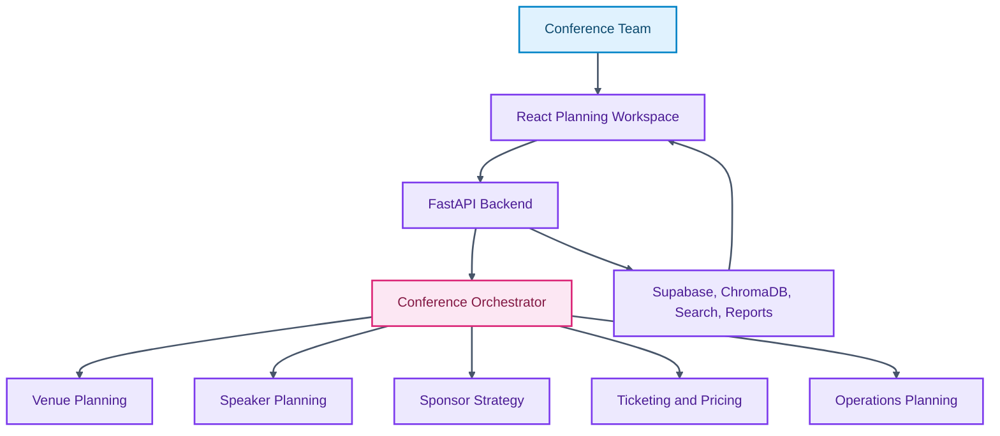

# Confera

<p align="center">

  
  
  
  
  
  
</p>

<p align="center">
  <strong>A full-stack conference intelligence platform for coordinating planning, operations, GTM, pricing, sponsors, speakers, and venues.</strong>
</p>

Confera provides an integrated planning workspace for complex events. It decomposes the conference lifecycle into specialized workflows while preserving a single user-facing dashboard for progress, recommendations, and operational decisions.

## Core Capabilities

- Coordinates specialized event-planning modules across the conference lifecycle.
- Supports real-time backend updates over websockets.
- Integrates search, vector storage, persistence, and report generation services.
- Provides a React interface for planning review and execution.

## Technical Architecture

The backend uses FastAPI with domain modules, shared schemas, routes, tools, and services. The frontend uses React, TypeScript, routing, charting, state management, and Tailwind styling.

## Architecture Diagram



## Technology Stack

- FastAPI and Pydantic for backend services.
- React, TypeScript, and Vite for frontend delivery.
- Supabase, ChromaDB, Tavily, and Google Places integrations.
- Websocket manager for live coordination.
- Docker/deployment files for hosting workflows.

## Repository Structure

- `backend/agents` - Specialized planning modules.
- `backend/routes` - API and websocket routes.
- `backend/services` - Persistence, cache, vector, and websocket services.
- `backend/tools` - External data and search tools.
- `frontend/src/App.tsx` - Frontend application shell.
- `Dockerfile` - Container build definition.

## Getting Started

```bash
cd backend && python -m venv .venv
source .venv/bin/activate
pip install -r requirements.txt
cd ../frontend && npm install
```

```bash
cd backend && uvicorn main:app --reload
cd frontend && npm run dev
```

## Professional Context

This project demonstrates full-stack planning systems, real-time service design, and product engineering for event operations.
